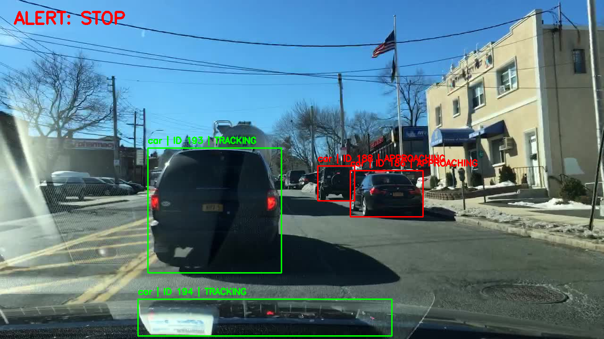
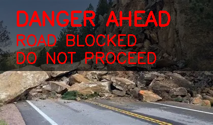

# 🚧 Hairpin Road CV Safety System

At hairpin bends and blind curves in hilly terrain, drivers are forced to make decisions with little or no visibility.  
Convex mirrors provide distorted and unreliable information, especially in fog, rain, night conditions, or during sudden road blockages like landslides.

This project explores a different approach.

---

## 🧠 Core Idea

Instead of trying to improve visibility, this system **eliminates the need for visibility** by converting unseen hazards into **clear safety instructions** for the driver.

The system answers one simple question:

> **Should the driver proceed, slow down, or stop?**

---

## ⚙️ How It Works (High Level)

1. A camera is assumed to be placed near a hairpin bend (similar to a convex mirror location)
2. Oncoming vehicles are detected and tracked to infer proximity risk
3. Road surface visibility is analyzed to detect sudden obstructions (e.g., landslides)
4. All signals are fused using strict priority rules into a single safety decision:
   - **ROAD BLOCKED → DO NOT PROCEED**
   - **ONCOMING VEHICLE → WAIT**
   - **LIMITED VISIBILITY → PROCEED SLOWLY**
   - **CLEAR ROAD → GO**

---

## 📸 Example Outputs

### Oncoming Vehicle Detection

### Road Blockage Detection

---

## 🎯 Why This Matters

- Removes human guesswork at blind curves
- Works even when mirrors fail (fog, rain, night)
- Detects hazards mirrors cannot (road blockages)
- Focuses on **decision abstraction**, not raw visuals

---

## 🛠️ Tech Stack

- Python
- OpenCV
- YOLO (pretrained object detection)
- Simple rule-based risk fusion

---

## 🚀 Status

This is a **system-level prototype** demonstrating how intelligent roadside perception can improve safety at hairpin bends and blind curves.

---

## 📌 Author

Sivaramakrishnan
